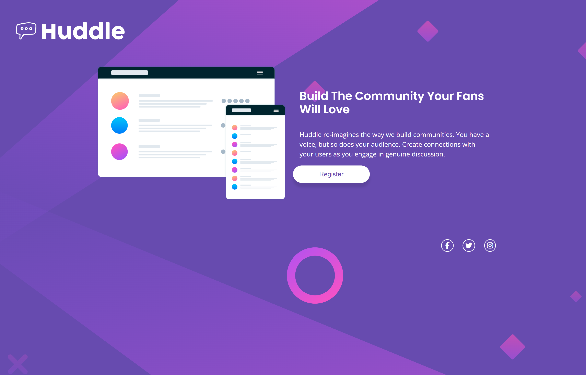

# Frontend Mentor - Huddle landing page with single introductory section solution

This is a solution to the [Huddle landing page with single introductory section challenge on Frontend Mentor](https://www.frontendmentor.io/challenges/huddle-landing-page-with-a-single-introductory-section-B_2Wvxgi0). Frontend Mentor challenges help you improve your coding skills by building realistic projects.

## Table of contents

- [The challenge](#the-challenge)
- [Screenshot](#screenshot)
- [Links](#links)

- [Built with](#built-with)
- [What I learned](#what-i-learned)
- [Continued development](#continued-development)
- [Useful resources](#useful-resources)
- [Author](#author)

### The challenge

Users should be able to:

- View the optimal layout for the page depending on their device's screen size
- See hover states for all interactive elements on the page

### Screenshot




### Links

- Solution URL: [Add solution URL here](https://github.com/remainhumble/Huddle-landing-page-with-a-single-introductory-section)
- Live Site URL: [Add live site URL here](https://remainhumble.github.io/Huddle-landing-page-with-a-single-introductory-section/)

### Built with

- Semantic HTML5 markup
- CSS custom properties
- Flexbox
- Mobile-first workflow

### What I learned

During this project, I deepened my understanding of responsive design and semantic HTML. I learned how to use Flexbox to create layouts that adapt smoothly to different screen sizes. For example, I used the following CSS to center content both vertically and horizontally:

```css
.container {
  display: flex;
  flex-direction: column;
  justify-content: center;
  align-items: center;
  min-height: 100vh;
}
```

### Continued development

In future projects, I want to continue focusing on:

- Improving my understanding of advanced Flexbox and CSS Grid layouts for more complex responsive designs.
- Enhancing accessibility by following best practices for semantic HTML and ARIA roles.
- Refining my use of CSS custom properties for better theme management and maintainability.
- Exploring more efficient ways to structure and organize CSS for scalability.
- Perfecting my workflow with version control and deployment tools.

### Useful resources

- [How To Create a Full Page Image - W3Schools](https://www.w3schools.com/howto/tryit.asp?filename=tryhow_css_full_page) - This helped me familiarise myself with background properties in css.

## Author

- Frontend Mentor - [@remainhumble](https://www.frontendmentor.io/profile/remainhumble)
